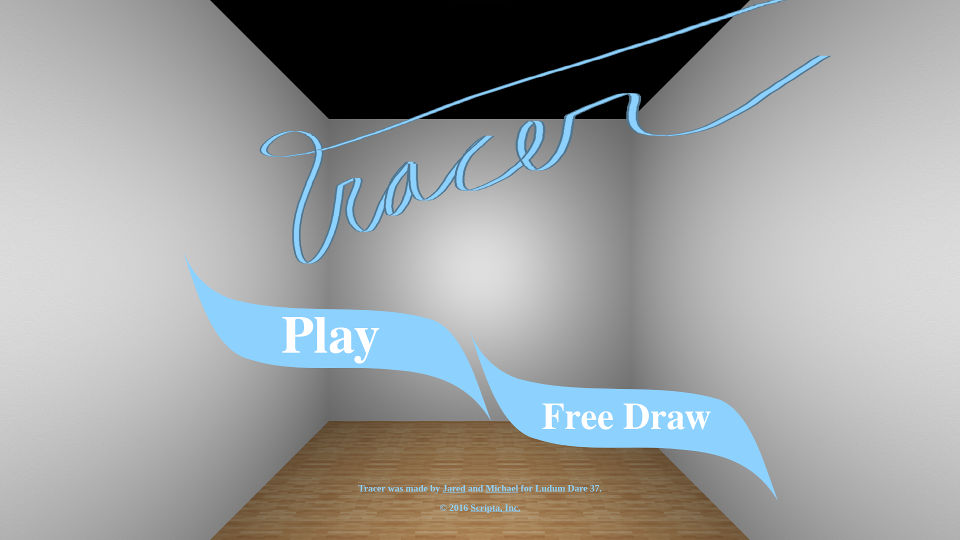

# Tracer

A web game. Connect the dots in 3D. Built in 72 hours for Ludum Dare 37.

[Play now!](http://scripta.co/tracer/)

## Setup

    npm install

## Development commands

Start a development environment with BrowserSync:

    npm start

BrowserSync will automatically reload your browser when files
change.  No more manual refreshing!  You can open the game in multiple browsers
and they will all be refreshed together.  Clicks will also be synchronized so
you can test the game in several browsers at the same time.

## External libraries

External libraries are included old-school, copy them to `src/libs/` and
include them with a script tag in `index.html`.
